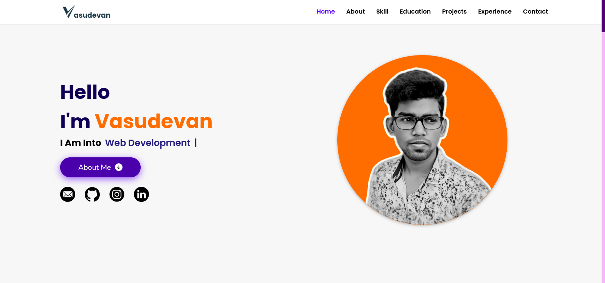

# Personal Portfolio Website



This is my personal portfolio website developed using pure HTML and CSS. The website showcases my skills, projects, and provides information about me.

## Live Demo
Visit the live website: [vasu3.netlify.app](https://vasu3.netlify.app)

## Features

- Clean and responsive design
- Sections for about me, skills, projects, and contact information
- Simple and easy to navigate

## Technologies Used

- HTML
- CSS

## Deployment

The website is deployed on [Netlify](https://www.netlify.com/). Any changes pushed to the main branch on GitHub will trigger an automatic deployment.

## Getting Started

To run the project locally, simply clone the repository and open the `index.html` file in your web browser.

```bash
git clone https://github.com/your-username/your-portfolio.git
cd your-portfolio
